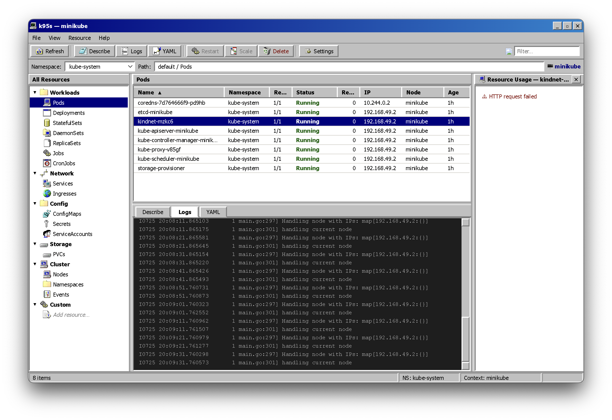

# k95s

> A Windows 95-themed Kubernetes UI. Like k9s, but clickable.



## What is this

It's a Kubernetes dashboard that looks like it was designed by someone who only used computers in 1995 and has never recovered.

- **371 lines of JavaScript** written by a human (the rest was vibecoded by AI)
- **223 lines of CSS** in the Windows 95 aesthetic (raised borders, beveled edges, the whole deal)
- **Zero accessibility** (by design — the 90s didn't care about your screen reader)

## Features

| Feature | Status |
|---------|--------|
| See your pods? | ✅ |
| Describe stuff? | ✅ |
| View YAML? | ✅ |
| Real-time log streaming? | ✅ (finally) |
| Restart deployments? | ✅ |
| Scale things up? | ✅ |
| Delete things? | ✅ (with confirmation, because trauma) |
| Custom resource types? | ✅ (because CRDs are the real deal) |
| Sub-resource panels? | ✅ (owned pods, because nesting is fun) |
| Search/filter? | ✅ (Ctrl+F for the soul) |
| Memory/CPU metrics? | ✅ (if metrics-server cooperates) |
| Windows 95 aesthetic? | ✅ (raised borders, 3D bevels, the full experience) |

## Install

Download the latest release from the [GitHub Releases page](https://github.com/SirTediousOfFoo/k95s/releases).

| Platform | Format | Size |
|----------|--------|------|
| macOS (Intel) | `.dmg` | ~93 MB |
| macOS (Apple Silicon) | `.dmg` | ~93 MB |
| Linux | `.AppImage` | ~104 MB |

### macOS

Double-click the `.dmg`, drag to Applications. That's it. You're welcome.

### Linux

```bash
chmod +x k95s-*.AppImage
./k95s-*.AppImage
```

## Requirements

- A Kubernetes cluster (duh)
- `kubectl` on your PATH (it spawns `kubectl logs --follow` under the hood)
- A sense of nostalgia (optional but recommended)

## Configuration

Settings are persisted in your platform's app data directory:

- **macOS:** `~/Library/Application Support/k95s/settings.json`
- **Linux:** `~/.config/k95s/settings.json`

You can configure:
- Kubeconfig path (defaults to `~/.kube/config`)
- Context
- Default namespace

## Keyboard Shortcuts

| Key | Action |
|-----|--------|
| `F5` | Refresh |
| `Enter` | Describe selected |
| `Delete` | Delete selected (with confirmation, because we're not savages) |
| `↑/↓` | Navigate |
| `Ctrl+F / Cmd+F` | Search/filter |

## Architecture

```
main.js          — Electron main process, k8s API, kubectl IPC
preload.js       — Bridge between main and renderer
renderer.js      — UI logic, DOM manipulation, event handling
index.html       — The UI shell (Windows 95 approved)
styles.css       — 900+ lines of pixel-perfect 90s nostalgia
```

**Hotspot functions** (the ones doing the heavy lifting):
- `escHtml` — used 12 times, the workhorse of XSS prevention
- `setStatus` — status bar updates, the app's mood ring
- `handleAction` — the central dispatcher for all user actions

## Why does this exist

Because sometimes you need a Kubernetes UI that makes you feel like you're back in 1995, staring at a beige monitor, wondering why the internet is so slow.

Also, k9s is great but sometimes you just want to click things like a normal person.

## License

MIT (because open source is free, unlike therapy)

---

*Disclaimer: This software is fully AI-generated with exactly one line written by a human. The human has regrets.* 😢
